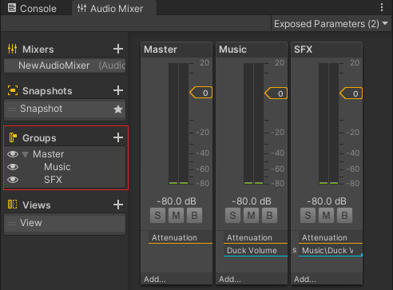

#Unity中实现音频管理 AudioMixer的使用

## 一，较为通用的方法 
1. 创建AudioManager类，该类一般使用单例实现，方便后续在其它地方调用。
2. 场景中创建一个空物体挂载该类，该物体下创建两个物体分别挂载AudioSource组件 一个用于Music 一个用于SFX
3. 类中需要定义这两个AudioSource并赋值。
4. AudioManager两个方法，一个用于播放Music 一个用于播放SFX，通过单例调用。
5. 音频配置，可通过数组定义出来(AudioClip[])，但是调用时不清晰。可以通过创建自定义类Sound，配置音频信息（音频名字，音频片段，是否循环等）等，创建公开数组（Sound[]），配置音频信息，对播放方法作更改，调用时可以通过音频名字，也可配置参数等。
6. 控制音量，可以通过AudioSource自带API创建不同方法，给UI中的Slider或Toggle赋方法 滑动调节音量，静音等

***示例场景 SoundDemo1 SoundDemo2***

## 二，AudioMixer（音频混合器）的使用
1. 与第一种前5步基本相同，在音频设置上有所不同。
2. 创建AudioMixer，在Group下创建Music和SFX子组，并在AudioSource组件下的Output中分别选中该子组。
   
   
3. 音频的独奏，静音，旁路，音量管理都可在AudioMixer中设置。AudioMixer此时有Master Music SFX组分别控制总的音频，Music，SFX源。
4. 此外AudioMixer中还可以设置音频效果等 例：当SFX播放时，背景音乐音量变小。
   1. 在AudioMixer中选中Music组，Add添加Duck Volume效果，在SFX组下Add-Send点击，Receive下拉框中选择Music/Duck Volume即可
   
   
5. 如何在脚本中设置AudioMixer的参数？设置音量滑条，静音按钮等
   1. 选中Music组，在想要设置的参数上鼠标右键选择Expose，将参数暴露出来即可设置。
      
      
      
   2. 音量设置时需要注意：AuidoMixer中的音量范围为-80db-20db,而Slider默认值为0-1。不可以直接赋值，需要进行换算。
        1. 具体将Slider值设置为0.0001-1。
        
        2. 代码：
        ```CSharp
      public void SetMusicVolume()
        {
            float volume = musicSlider.value;
            myMixer.SetFloat("Music", Mathf.Log10(volume) * 20);//Slider值和AudioMixer转换
            PlayerPrefs.SetFloat("musicVolume", volume);
        }
        ```
6. 保存和加载音频设置，使用PlayPrefs,存储相关参数，初始化中判断和加载。

***示例场景 SoundDemo3***